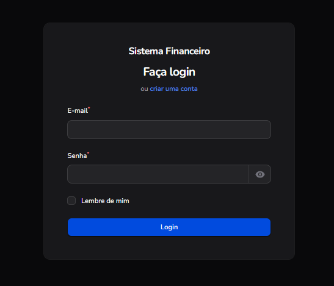
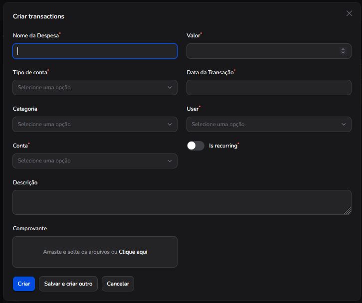
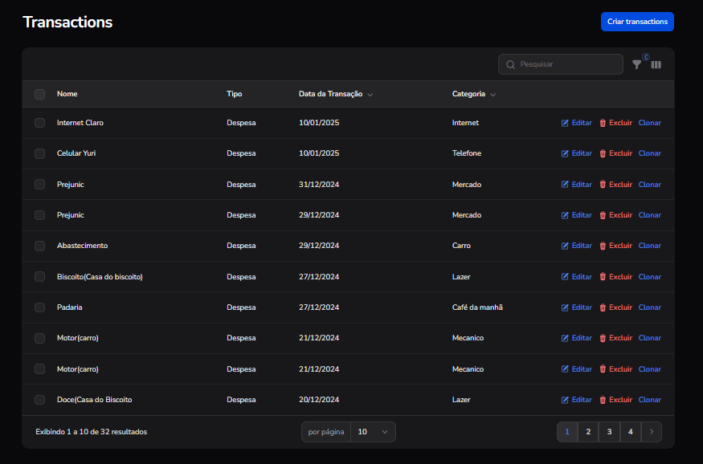
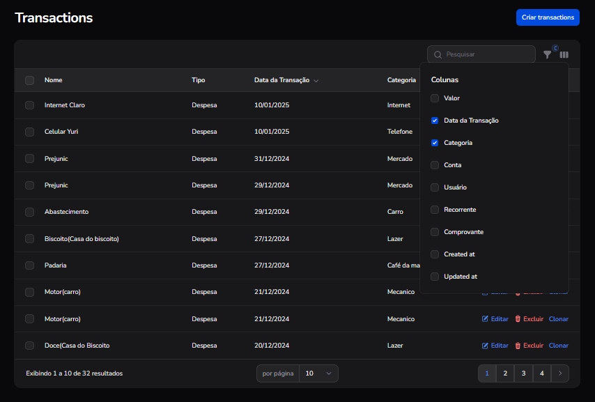
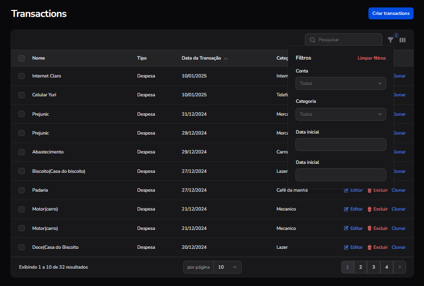

# Financial System 🚀

If you liked the repository, please add a star to help out.

My project is currently under construction.


Clone the repository using the following command:
```shell
git@github.com:yuri-spm/financial-system.git
```
Navigate to the Project Directory
```shell
cd financial-system
```
Install Dependencies
```shell
composer dump-autoload
```
Use the following command to start the server:
```shell
php artisan serve
```

Use the following command to build the assets for development:
```shell
npm rum dev
```

After setting up, access the project in your browser at:
```shell
http://localhost:8000/admin/login
```

Login screen



Transactions screen



Registered items







